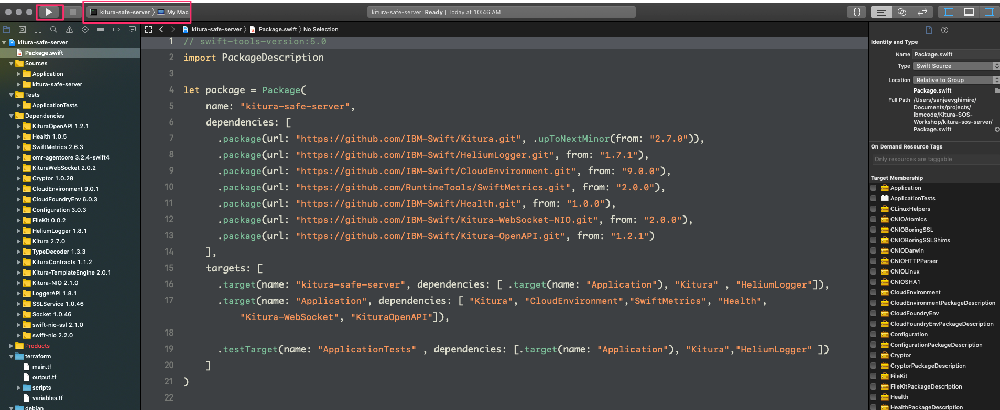
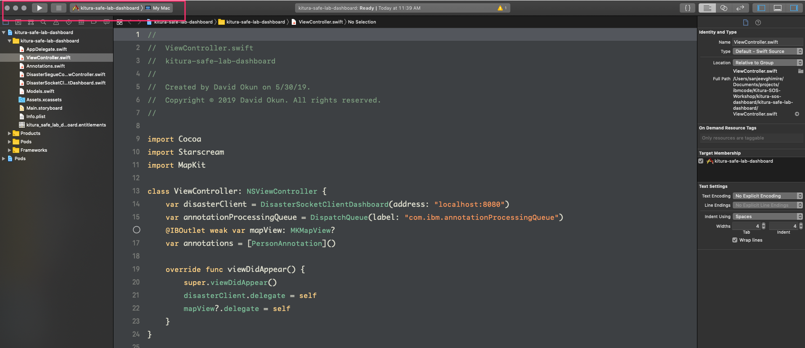

# Kitura SOS Workshop

<p align="center">

</p>

<p align="center">
<a href= "http://swift-at-ibm-slack.mybluemix.net/">
    
</a>
</p>

## Workshop Table of Contents:

1. **[Getting Started](./01-GettingStarted.md)**
2. [Setting up the Server](./02-ServerSetUp.md)
3. [Setting up the Dashboard](./03-DashboardSetUp.md)
4. [Setting up the iOS Client](./04-iOSSetUp.md)
5. [Handling Status Reports and Disasters](./05-StatusReportsAndDisasters.md)
6. [Setting up OpenAPI and REST API functionality](./06-OpenAndRESTAPI.md)
7. [Build your app into a Docker image and deploy it on Kubernetes](./07-DockerAndKubernetes.md)
8. [Enable monitoring through Prometheus/Grafana](./08-PrometheusAndGrafana.md)

# Getting Started

## Requirements

- [Cocoapods](https://cocoapods.org)
- Swift 5.0+
- Terminal
- Xcode

### Optional

- [ngrok](https://ngrok.com/)
- An iOS device that can run apps from Xcode

## Initial Set up

### Clone repository

First, clone the starter branch of the repository by running these terminal commands:

```bash
git clone -b starter https://github.com/IBM/Kitura-SOS-Workshop.git
cd Kitura-SOS-Workshop
```

**Note:** The `master` branch is the completed workshop, whereas the `starter` branch is the branch we will be using.

### Setting up the server

1. Open Terminal.
2. Navigate to the `kitura-sos-server` directory located in the projects root folder.
3. In your terminal run,  `export KITURA_NIO=1`
4. Run `swift package generate-xcodeproj` in the Terminal, then `xed .`. When the command is done. ***`swift package generate-xcodeproj` generates all the necessary packages that our project uses and `xed .` opens our project in Xcode***
5. In Xcode, run the server on My Mac.

6. Open a web browser, and navigate to `localhost:8080`. If you see the Kitura home page, you are ready to go! Don't quit the server!

### Setting up the macOS client (dashboard)

1. Open Terminal.
2. Navigate to the `kitura-sos-dashboard` directory located in the projects root folder.
3. Run `pod install` and  `xed .` in the terminal.

> Note: if you don't have cocoapods, please install or upgrade from  [Cocoapds](https://cocoapods.org/)

4. Run the main application on My Mac.


5. Accept location tracking for the application.

You also may need to turn off code signing on your Xcode. To do this:

- go to `Build Settings` in your Xcode project
- search "identity"
- make sure you have an empty text box for identities

### Setting up the iOS client

1. Open Terminal.
2. Navigate to the `kitura-safe-ios-client` directory.
3. Type `ls` - if you see `Podfile` in the resulting output, then you are in the right place.
4. Enter `pod install` into Terminal.
5. Enter `xed .` into Terminal.
6. Run the main application on an iOS simulator of your choice.
7. Tap `Always Allow` when prompted for location tracking on the iOS app.
8. With the iOS simulator open, click the `Debug` menu in the top toolbar, then Location -> Custom Location. Enter your coordinates here to simulate where you are. 590 Madison Avenue is at `(40.762157, -73.973030)`.

If you want to test this with real devices, either deploy this server and use the address, or use [ngrok](https://ngrok.com) to tunnel connections through to localhost, and then update the addresses in both the macOS and iOS clients. This can handle *many* concurrent connections, and the pins should drop when the responses are received.

# Next Steps

Continue to the [next page](./02-ServerSetUp.md) to set up the Server.
